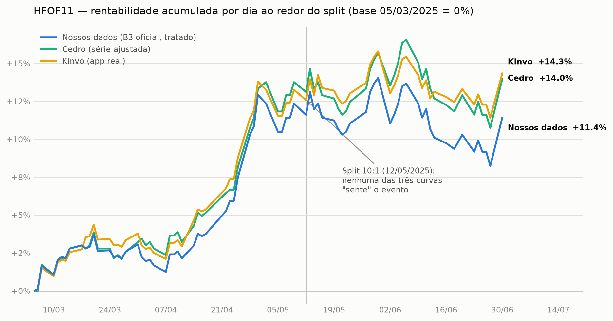
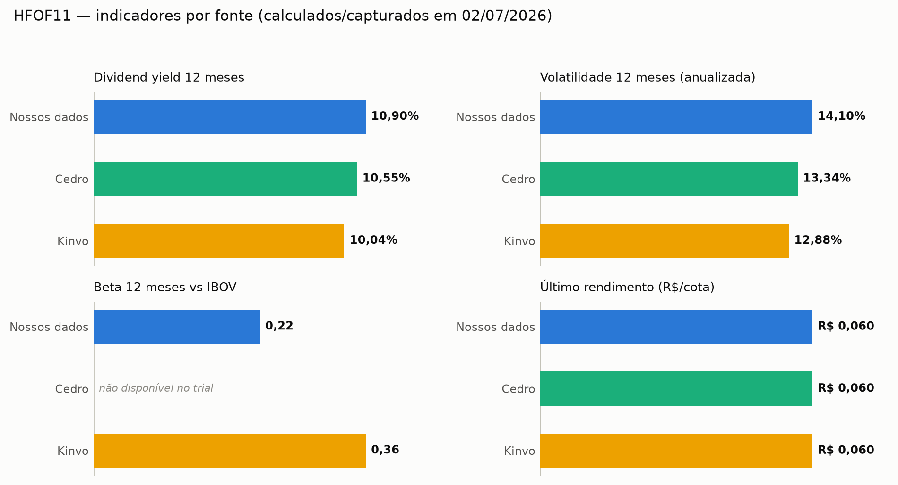
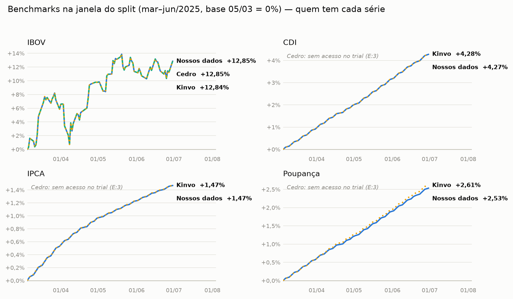

# Avaliação da API Cedro — Resumo para a Diretoria

**Data:** 02/07/2026 · **Assunto:** vale a pena contratar a Cedro como nova fonte de
dados de mercado? · **Em uma frase:** vale a pena para **proventos** (dividendos,
JCP e rendimentos de FII), agrega em **splits**, mas **não substitui** o que já
temos para histórico de preço.

---

## 1. O que está em jogo

Nosso aplicativo precisa de "dados de mercado" para funcionar: **quanto vale cada
ativo hoje**, **quanto o cliente recebeu de dividendos**, e **como o preço se
comportou ao longo dos anos** para desenhar os gráficos de rentabilidade. Hoje
buscamos esses dados em **várias fontes gratuitas ou de baixo custo** e "costuramos"
elas juntas. Isso funciona, mas dá trabalho e, de vez em quando, gera pequenas
divergências (foi a causa de vários ajustes que fizemos nos últimos meses).

A **Cedro** é um fornecedor **profissional** de dados da Bolsa (B3). A promessa é:
em vez de costurar cinco fontes, ter **uma fonte só, mais completa e confiável**.
Recebemos um acesso de teste ("trial") e passamos os últimos dias comparando os
dados dela com os que já usamos. Este documento é o resultado.

---

## 2. O que usamos hoje (as fontes atuais)

| Fonte | Para quê usamos | Custo |
| --- | --- | --- |
| **BRAPI** | Cotação do dia e dividendos recentes — é a nossa fonte principal | Assinatura paga (plano fixo) |
| **Yahoo Finance** | Splits/desdobramentos e histórico antigo | Gratuita |
| **Arquivo oficial da B3 (COTAHIST)** | Histórico de preço "de verdade", oficial, desde 2016 | Gratuita (arquivo público) |
| **Tesouro Direto / BACEN / CVM** | Títulos públicos, índices e fundos | Gratuitas (fontes oficiais) |
| **CoinGecko** | Criptomoedas | Gratuita |

Ou seja: já temos uma base sólida e barata. A pergunta não é "temos dados?", e sim
"**a Cedro melhora a qualidade a ponto de justificar o custo?**".

---

## 3. Comparação, quesito por quesito

| Quesito | Como estamos hoje | O que a Cedro entrega | Veredito |
| --- | --- | --- | --- |
| **Dividendos, JCP e rendimentos de FII** | Combinamos BRAPI + Yahoo; às vezes falta a "data-com" e é preciso adivinhar | Traz tudo de **uma fonte só**: valor, tipo, e as três datas (com/ex/pagamento). Mais completo para **fundos imobiliários** | ✅ **Cedro ganha** — melhor ponto dela |
| **Splits / desdobramentos** | Yahoo é a base; já causou bugs de duplicação | Identifica o tipo do evento **com mais precisão**, mas num teste **deixou passar um split antigo de FII** que a fonte oficial confirma | ⚠️ **Empate / usar as duas juntas** |
| **Histórico de preço (gráficos)** | Arquivo **oficial da B3** desde 2016 + BRAPI | Série longa e bem-feita, mas no plano de teste vem num formato que **não encaixa** direto no nosso, e nossa fonte já é a **oficial** | ➖ **Não substitui hoje** |
| **Cotação do dia** | BRAPI já resolve | Traz extras (preço de compra/venda, máxima/mínima) que hoje não temos | ➕ Complementa, não é essencial |
| **Lista de ativos da Bolsa** | BRAPI + CVM | Redundante com o que já temos | ➖ Serve só para conferência |

**Leitura rápida:** a Cedro é claramente melhor em **proventos**, é uma boa
segunda opinião em **splits**, e **não muda o jogo** no resto.

---

## 4. O exemplo do split — HFOF11 (o teste mais concreto)

Pedimos para focar num ativo que passou por um **split** (desdobramento), porque é
justamente onde os dados costumam divergir e onde já tivemos bugs. Escolhemos o
fundo imobiliário **HFOF11**, que fez um **desdobramento de 10 para 1 em maio de
2025** — ou seja, cada cota virou 10 cotas, e o preço, naturalmente, foi dividido
por 10.

### 4.1 O evento em si — quem reporta certo?

| Fonte | Reporta o split? | Fator | Datas | Observação |
| --- | --- | --- | --- | --- |
| **Cedro** | ✅ Sim, 1 evento único | 10:1 (registrado como "+900%") | com 09/05, ex 12/05, **pag 13/05** | Classifica corretamente como "Desdobramento" e traz **as três datas** |
| **Yahoo Finance** | ✅ Sim | 10:1 | ex 12/05 | Correto, mas **sem a data-com** |
| **BRAPI** | ❌ Não traz o split isolado | — | — | Por isso precisávamos combinar com o Yahoo |
| **Nosso sistema (antes do ajuste)** | ⚠️ Sim, porém **duplicado** | **20:1 (errado!)** | — | BRAPI e Yahoo somavam o mesmo evento → fator dobrado. **Este foi um dos bugs que corrigimos** |

**Conclusão do 4.1:** a Cedro, por ser **fonte única**, elimina na raiz o risco de
duplicação que nos causou dor de cabeça. E entrega a "data-com", que o Yahoo não tem.

### 4.2 Por que isso importa — a "queda-fantasma"

Este é o ponto que vale a pena a diretoria entender, porque é onde o cliente sente
no bolso (visualmente). Veja o preço do HFOF11 nos dias ao redor do split:

| Dia | Preço **sem** tratamento (nominal) | Preço **tratado** (correto) |
| --- | --- | --- |
| 09/05/2025 (antes) | ≈ **R$ 52,90** | R$ 5,29 |
| 12/05/2025 (dia do split) | **R$ 5,26** | R$ 5,26 |
| Variação aparente | **−90%** 😱 | **estável** ✅ |

Sem o tratamento correto do split, o gráfico do cliente mostraria uma **queda de
90% da noite para o dia** — uma perda que **nunca existiu** (ele simplesmente passou
a ter 10× mais cotas valendo 1/10 cada). Tratar o split certo é o que evita esse
"susto" no gráfico. **Tanto a Cedro quanto nossa correção atual já fazem isso
corretamente** — a diferença é que com a Cedro isso viria pronto e de uma fonte só,
em vez de costurado.

> Detalhe técnico que confirma o evento: no dia do split o **volume negociado saltou
> de ~17 mil para ~204 mil cotas** — comportamento típico de um desdobramento, e que
> bate em todas as fontes.

### 4.3 A prova no gráfico — rentabilidade dia a dia: nossos dados × Cedro × Kinvo

Para fechar a comparação, colocamos lado a lado a **rentabilidade diária acumulada**
do HFOF11 nos ~4 meses ao redor do split (mar–jun/2025), de **três fontes
independentes**: nossos dados de produção (arquivo oficial da B3), a série da
Cedro (captura ao vivo de 30/06) e o **Kinvo** — o app concorrente que usamos como
benchmark — capturado do aplicativo real em 02/07:

O que o gráfico mostra:

- **As três curvas contam a mesma história.** Dia a dia, a diferença média entre
  qualquer par de fontes fica entre **0,10 e 0,17 ponto percentual** — e nenhuma
  das três "sente" o split: no dia 12/05 as curvas seguem em linha reta, como
  deve ser (sem a queda-fantasma de −90% descrita no item 4.2).
- **Kinvo e Cedro fecham quase juntas (+14,3% × +14,0%)** — as duas embutem os
  rendimentos mensais do fundo na série (como se fossem reinvestidos). Duas
  fontes independentes chegando a 0,35 ponto uma da outra é uma validação
  cruzada forte das duas.
- **A nossa curva (+11,4%) fica ~2,9 pontos abaixo, e isso não é erro:** nossa
  série mostra **só o preço** da cota, sem embutir os rendimentos — que, em 4
  meses, somam justamente essa diferença. É a demonstração prática do item 3:
  o formato da Cedro (e do Kinvo) é **diferente** do nosso — bom para
  conferência, mas não é um encaixe direto para substituir nossa série de preço.

**Resumo do gráfico:** os três lados tratam o split corretamente e contam a mesma
história; as divergências que existem são **metodológicas e explicadas** (com ou
sem rendimentos embutidos), não erros de dados.

### 4.4 Indicadores do ativo — o que cada fonte informa

Além do gráfico, comparamos os **indicadores-resumo** que aparecem na página do
ativo — quanto ele rende, quanto oscila e quanto acompanha a Bolsa:

O que os números dizem:

- **Rendimento (dividend yield) e volatilidade: as três fontes contam a mesma
  história** (10,0–10,9% e 12,9–14,1%). As pequenas diferenças vêm da janela e do
  preço de referência que cada um usa — e a soma dos 12 rendimentos do ano **bate
  ao centavo** entre nossos dados e a Cedro (R$ 0,692 por cota), com o último
  rendimento (R$ 0,06) idêntico nas três.
- **Beta é o exemplo de indicador em que a metodologia muda tudo:** nosso cálculo
  dá 0,22 e o Kinvo mostra 0,36 — e, curiosamente, **dentro do próprio Kinvo**
  existem dois números diferentes (0,36 na tela de análise e 1,64 no serviço de
  indicadores fundamentalistas). Moral: comparar beta entre plataformas sem
  conhecer a conta por trás não é confiável — divergência aqui não indica erro
  de dados.
- **P/VP (0,85) e valor patrimonial por cota (R$ 8,02): hoje só o Kinvo informa.**
  Nem nossos dados nem a Cedro (no trial) trazem o patrimônio dos FIIs — se
  quisermos exibir esses indicadores, a fonte seria outra (informes oficiais da
  CVM), não a Cedro.

**Resumo dos indicadores:** nos que dependem de dados brutos (rendimento,
volatilidade), todo mundo concorda; nos que dependem de metodologia (beta), até a
mesma plataforma diverge de si mesma. **A Cedro não traria vantagem aqui** — mais
um reforço de que o valor dela está nos proventos, não nos indicadores.

### 4.5 Os benchmarks do nosso gráfico — IBOV, CDI, IPCA e Poupança nos três sistemas

O gráfico de rentabilidade do nosso app compara o ativo com as referências
clássicas do investidor brasileiro: **IBOV, CDI, IPCA e Poupança**. Verificamos,
uma a uma, **quem tem cada série e se os números batem** — nossos dados × Cedro
(consulta ao vivo de 02/07) × Kinvo (captura do app real):

O que a comparação mostra, painel a painel:

- **IBOV — três fontes, praticamente idênticas:** +12,85% (nós) × +12,85%
  (Cedro) × +12,84% (Kinvo). As três curvas ficam sobrepostas no gráfico.
- **CDI — nossos dados × Kinvo: 0,01 ponto de diferença (+4,27% × +4,28%).**
  Visualmente indistinguíveis.
- **IPCA — nossos dados × Kinvo: idênticos (+1,47% nos dois).**
- **Poupança — +2,53% (nós) × +2,61% (Kinvo).** Diferença de 0,08 ponto em 4
  meses, explicada pela convenção de cálculo (a poupança rende na "data de
  aniversário" do depósito; cada sistema dilui isso de um jeito).
- **Cedro:** no nosso acesso de teste, só o **IBOV** está liberado. Os mercados
  de índices/indicadores econômicos **existem no protocolo dela**, mas o trial
  responde "sem permissão" (erro E:3) — então não dá para avaliar CDI/IPCA/
  Poupança da Cedro sem contratar (ou pedir liberação no trial).

**Resumo dos benchmarks:** nós e o Kinvo cobrimos as quatro referências — e
**tudo o que se sobrepõe, bate** (a maior diferença foi 0,08 ponto na Poupança,
por convenção de cálculo). A Cedro, no acesso atual, só mostra o IBOV — que
também bate. Nossos dados de referência (BACEN + B3) estão validados contra os
dois concorrentes.

### 4.6 A honestidade da avaliação — onde a Cedro falhou

Para não passar uma imagem só positiva: testamos também o **MXRF11**, outro fundo
imobiliário que fez um split de 10:1 **em 2017**. A Cedro **não reportou esse
evento** — mas o **arquivo oficial da B3** confirma que ele é real (o preço saiu de
R$ 89 para R$ 9,98). Ou seja, a Cedro **não é infalível** para eventos antigos de
FII. Por isso a recomendação em splits é **usar Cedro e Yahoo em conjunto**, e não
trocar uma pela outra.

Essa falha foi verificada com rigor, por quatro caminhos independentes:

1. **Nosso banco de produção** (arquivo oficial da B3): o preço cai de R$ 89 para
   R$ 9,98 na data — o split é real;
2. **Fontes públicas independentes** (Investing.com, Suno, XP, StatusInvest):
   todas registram o desdobramento de 10:1 em 17/05/2017;
3. **Reconferência ao vivo na própria Cedro (02/07)**: consultamos de novo, em
   duas janelas de datas — o evento realmente não é reportado;
4. **A "impressão digital" nos dados da própria Cedro**: os rendimentos mensais
   que ela informa caem 10 vezes (de ~R$ 0,95 para ~R$ 0,10 por cota) exatamente
   na data do split — ou seja, a base dela reflete o evento, mas não o expõe.

---

## 5. Pontos comerciais a resolver antes de fechar

Independente da qualidade técnica, há três pendências de negócio:

1. **Custo:** ainda não temos o modelo de cobrança da Cedro (valor fixo? por
   ativo/consulta/usuário?). Hoje a BRAPI é um valor fixo previsível — precisamos
   comparar.
2. **Licença de redistribuição da B3:** repassar cotação da Bolsa para o cliente
   final exige licença de dados de mercado. Confirmar se já está incluída no contrato.
3. **Prazo:** o acesso de teste **expira em 03/07/2026**. A avaliação técnica já
   está concluída; a decisão comercial pode seguir sem pressa do trial.

---

## 6. Recomendação

- **Contratar a Cedro especificamente para PROVENTOS** (dividendos, JCP e
  rendimentos de FII) é o passo de **maior retorno** — é onde ela é claramente
  superior e resolve dores reais que já nos custaram tempo.
- **Splits:** usar a Cedro **somando** ao que já temos, nunca substituindo.
- **Histórico de preço e cotação:** **manter o que temos** — nossa fonte já é a
  oficial da B3 e a Cedro não justifica a troca no plano atual.
- **Antes de assinar:** fechar as pendências comerciais do item 5 (principalmente
  **custo** e **licença B3**).

Em resumo: **é um bom fornecedor para um problema específico e valioso (proventos),
mas não um substituto de tudo.** A adoção recomendada é **cirúrgica**, não total —
o que também limita o custo.
